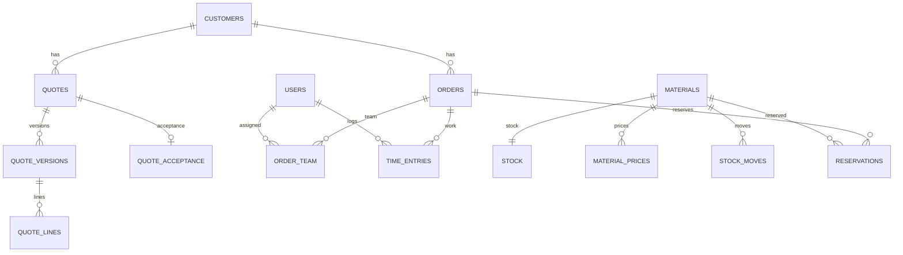

# EDNOR — Architektura bazy danych (Model B)

## Model procesu: Wycena → Akceptacja+Zaliczka → Zlecenie → Produkcja → Montaż → Serwis

Model B zakłada, że **zlecenie produkcyjne i montażowe powstaje dopiero po akceptacji wyceny i potwierdzeniu wpłaty zaliczki**. Dzięki temu dane handlowe (wycena) są oddzielone od realizacyjnych (produkcja/montaż/serwis), ale pozostają powiązane relacją źródłową.

## Tabele i przeznaczenie

- `customers` — kartoteka klientów (osoby/firma, dane kontaktowe, NIP, adresy).
- `quotes` — nagłówki wycen (status, klient, wartości sumaryczne, daty).
- `quote_versions` — wersjonowanie wyceny (historia zmian i rewizji).
- `quote_lines` — pozycje wyceny (elementy ogrodzenia/usługi, ilości, ceny, VAT).
- `quote_acceptance` — akceptacja/odrzucenie wyceny, data decyzji, warunki i zaliczka.
- `orders` — zlecenia realizacyjne utworzone z zaakceptowanych wycen.
- `order_team` — przypisanie użytkowników do zlecenia (role, ekipa, odpowiedzialność).
- `users` — konta systemowe i role uprawnień.
- `time_entries` — ewidencja czasu pracy (START/STOP, produkcja/montaż/serwis).
- `materials` — katalog materiałów i komponentów.
- `stock` — aktualny stan magazynowy dla materiałów.
- `material_prices` — historia cen zakupu/sprzedaży materiałów.
- `stock_moves` — ruchy magazynowe (przyjęcia, wydania, korekty).
- `reservations` — rezerwacje materiałów pod konkretne zlecenia.

## Diagram ER (Mermaid)

## Założenia typów danych

- Kwoty pieniężne: `DECIMAL(12,2)` (brak `FLOAT` dla wartości finansowych).
- Ilości materiałów: `DECIMAL(12,3)` dla jednostek niecałkowitych (np. metry bieżące).
- Stawki VAT i procenty: `DECIMAL(5,2)`.
- Daty zdarzeń biznesowych: `DATE` (np. termin montażu), znaczniki techniczne: `TIMESTAMP`.
- Klucze główne: `UUID` lub `BIGINT` (spójnie w całym systemie).
- Statusy procesowe: `ENUM` lub tabele słownikowe (preferowane przy częstych zmianach workflow).
